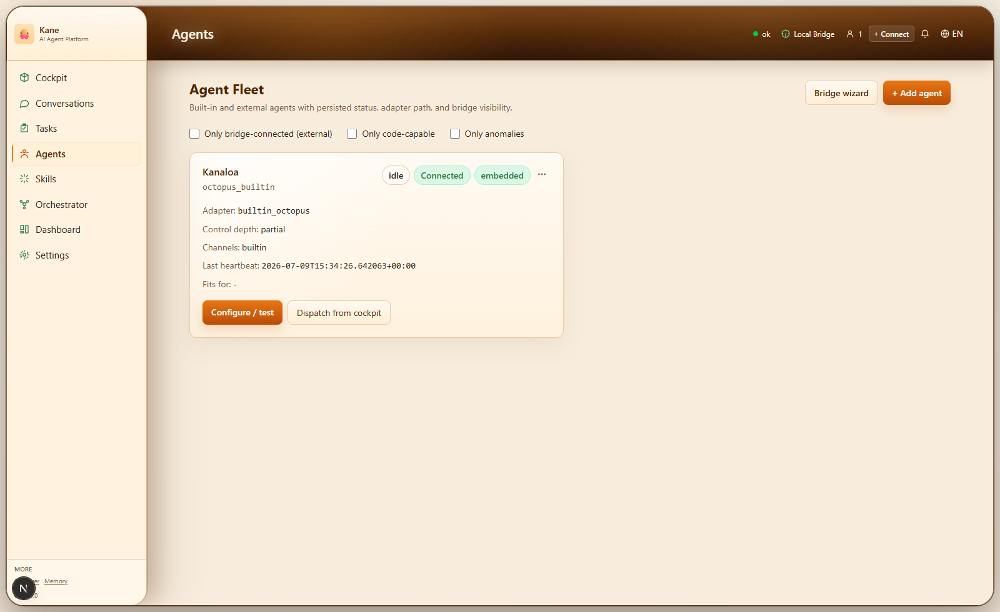
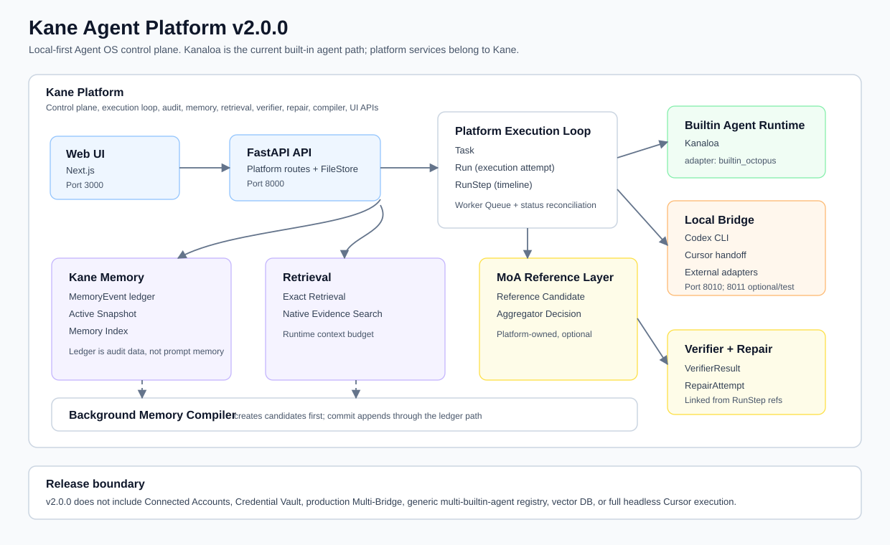

# Kane Agent Platform v2.0.0

Kane Agent Platform is a local-first Agent Operating System for agent execution. It combines a Next.js Web UI, FastAPI control plane, Local Bridge, agent adapters, task execution loop, memory audit, retrieval, verifier records, repair records, and background memory compilation into one local control surface.





Kane is not a Memory Framework, a RAG Framework, or a Workflow Engine. Memory, retrieval, MoA-style reference review, verification, repair, and UI audit surfaces exist to support agent execution.

## ⭐ Why Kane?

Modern agent systems are becoming powerful, but many of them still hide the most important part of the system: execution.

Planning, retrieval, verification, repair, memory updates, tool calls, and agent decisions are often buried inside opaque loops. When something fails, it is hard to answer the basic engineering questions:

- What happened?
- Why did the agent choose this path?
- What evidence did it use?
- What was verified?
- What failed?
- What changed after the failure?

Kane was designed from a different starting point.

Instead of treating agent execution as a black box, Kane turns execution into a first-class platform model.

A task is not just "sent to an agent."

It becomes:

- a Task,
- a Run,
- a RunStep timeline,
- linked evidence,
- verifier records,
- repair attempts,
- memory events,
- and final status reconciliation.

This gives Kane a different shape from prompt-first agent systems.

The important parts of execution are not hidden in prompts, temporary logs, or agent-specific runtime state. They become platform records that can be inspected, queried, verified, repaired, and improved over time.

Kane is not built around one model, one prompt, or one orchestration style.

It is built around a durable execution foundation that can support built-in agents, local adapters, handoff workflows, MoA-style reference review, memory compilation, verifier records, and repair loops without collapsing everything into one opaque agent loop.

The goal is simple:

**Make agent execution understandable, inspectable, and improvable.**

Not just executable.

## ⭐ What Is Kane

Kane is the platform. It owns the control plane, Task -> Run -> RunStep execution model, worker queue, memory ledger, retrieval services, verifier and repair records, background compiler, Local Bridge integration, and Web UI.

Kanaloa is not the platform and is not the memory subsystem. In v2.0.0, Kanaloa is the current default built-in AI agent path exposed through the seeded `octopus_builtin` agent, display name `Kanaloa`, and adapter type `builtin_octopus`. The platform can also dispatch to local external adapters such as Codex CLI and Cursor handoff through the Local Bridge.

## Core Features

- Next.js Web UI for dashboard, conversations, tasks, memory, settings, bridge, and agent fleet.
- FastAPI control-plane API for tasks, runs, run steps, agents, memory, retrieval, verifier, repair, and compiler records.
- Local Bridge service for local CLI execution, handoff, callback, and status reporting.
- Platform Execution Loop: Task -> Run -> RunStep, worker queue, executor/bridge result handling, and task status reconciliation.
- Kane Memory Ledger with append-only AI MemoryEvent writes, Active Snapshot, and Memory Index.
- Kanaloa built-in agent path for local platform-owned task execution.
- Exact Retrieval and Native Evidence Search.
- Platform Reference Candidate and Aggregator Decision records.
- VerifierResult records and RunStep verification references.
- RepairAttempt records and RunStep repair references.
- Background Memory Compiler candidate -> manual commit flow.
- Execution Audit UI for timeline, reference aggregation, verifier, repair, compiler, memory, and retrieval inspection.
- Repeatable local stack scripts, smoke tests, and safe stop/restore guidance.

## Architecture Overview



Default local ports:

```text
Web:    3000
API:    8000
Bridge: 8010
8011:   optional secondary/test bridge port used by stop/verification scripts when present
```

Port `8011` is not started by the default stack. It is reserved for optional secondary or acceptance-test bridge processes. The stop and verification scripts check it alongside `3000`, `8000`, and `8010` so a secondary local bridge cannot remain running silently.

## Quick Start

Requirements:

- Node.js 18+; Node.js 20+ recommended.
- Python 3.10+; Python 3.11+ recommended.
- Windows PowerShell for the bundled stack scripts on Windows.
- The root `npm install` installs workspace JavaScript dependencies, including Playwright for `test:e2e:smoke`.

From the repository root:

```bash
npm install
npm run setup
npm run dev:stack
```

In a second terminal:

```bash
npm run wait:stack
npm run test:e2e:smoke
```

Open:

```text
http://127.0.0.1:3000
```

On Windows you can use `npm.cmd` in place of `npm`.

## Verification

Offline baseline:

```bash
npm run typecheck:web
npm run test:api
npm run test:bridge
```

Live stack:

```bash
npm run dev:stack
npm run wait:stack
npm run test:e2e:smoke
```

Safe shutdown:

```bash
npm run stop:stack
```

`stop:stack` only stops processes that are manifest-owned or command-line verified as belonging to this repo's dev stack. It does not force-kill unknown listeners. Before restoring runtime data, verify that ports `3000`, `8000`, `8010`, and `8011` are down and HTTP probes fail.

See [docs/VERIFY.md](docs/VERIFY.md) and [docs/SAFE_STOP_AND_RESTORE.md](docs/SAFE_STOP_AND_RESTORE.md).

## Agent Architecture

Kane separates platform services from agent runtimes.

The platform owns task intake, the execution loop, the worker queue, shared services, and status reconciliation. Kanaloa sits below that as the current built-in AI agent runtime path. External agents sit behind the Local Bridge, including Codex CLI and Cursor handoff.

The current v2.0.0 built-in path is Kanaloa. The current code does not provide a generic multi-builtin-agent runtime registry.

## Execution Flow

- Task is the user or system goal.
- Run is one execution attempt.
- RunStep records atomic execution timeline steps such as plan, execute, summarize, verifier, repair, or handoff.
- Worker execution dispatches either to the built-in Kanaloa path or to Local Bridge adapters, and task status reconciliation keeps Task, Run, and RunStep terminal states aligned.
- Evidence, verifier results, repair attempts, reference aggregation, and memory events remain separate records linked by reference IDs.

Task, Run, and RunStep terminal states should not contradict each other. Failure paths must remain honest: permission errors, missing tools, and handoff states are recorded instead of being reported as fake success.

## Verification + Repair + Task Reconciliation Loop

Loop in v2.0.0 is a platform execution loop that includes:

- Task creation and assignment.
- Run creation for an execution attempt.
- RunStep timeline creation and finalization.
- Worker execution.
- Builtin executor or Local Bridge dispatch.
- Bridge callback/result handling.
- Verifier and repair references when present: VerifierResult checks execution; RepairAttempt records repair actions if verification fails.
- Task status reconciliation: Task, Run, and RunStep terminal states are aligned so they do not contradict each other. Failure paths remain honest.

## Platform-Owned MoA Layer

Kane provides infrastructure for multi-perspective decision making:

- Reference Candidate records: Multiple viewpoints (architect_reviewer, implementation_reviewer, security_reviewer, test_reviewer, docs_reviewer) on a RunStep.
- Aggregator Decision records: Synthesis of candidates with confidence, known gaps, and verifier requirements.
- RunStep reference linking: Decision records attached to execution steps via reference IDs.

This layer is optional and platform-owned, not Kanaloa-private. It is not automatic MoA orchestration (v2.0.0 does not claim that). Future agents can leverage these records for actual MoA strategies. The infrastructure is there; the automation is not (yet).

## Memory

Kane Memory in v2.0.0 includes:

- MemoryEvent append-only ledger for AI automatic writes.
- ActiveMemorySnapshot for current runtime memory.
- MemoryIndexEntry for lookup and current state.
- Background Memory Compiler candidates.

The full ledger is audit data. Runtime context should use Active Snapshot, Relevant Evidence, and Current Run Context instead of placing the full append-only ledger into prompts.

AI automatic writes are append-only by default. User-owned delete, rewrite, purge, migrate, and export semantics are preserved where implemented.

## Builtin Agent

Kanaloa is the current built-in agent path in v2.0.0. It is seeded as `octopus_builtin`, uses adapter type `builtin_octopus`, and executes through the API worker without requiring Local Bridge.

Builtin success must converge Task, Run, and RunStep terminal state. Builtin execution does not mean the whole platform is Kanaloa.

## External Agents

Kane v2.0.0 supports local external adapter acceptance paths:

- Codex CLI: reports real CLI availability and permission errors. A Windows `WinError 5` or permission failure is recorded as failure/attention, not success.
- Cursor: treated as handoff-oriented. Kane can create handoff work and track waiting state, but does not pretend Cursor completed full headless execution without a real callback/result.
- Other local CLI/HTTP adapter shapes exist in the control plane, but the public v2.0.0 release validates the local acceptance paths above.

## Local Bridge

Local Bridge is required for local external adapter flows such as Codex CLI and Cursor handoff. It owns local status, handoff, callback, and adapter probing. It must not pretend unavailable tools are online.

Default bridge runtime data lives under:

```text
apps/local-bridge/data/
```

This directory is ignored by Git.

## Project Structure

```text
apps/web              Next.js frontend
apps/api              FastAPI backend
apps/local-bridge     Local Bridge service
apps/data             Local API runtime data, ignored except .gitkeep
packages/core         Shared Python helpers
packages/schemas      Shared schemas
scripts               Local stack, setup, wait, stop, and E2E scripts
docs                  Public documentation
```

## Documentation

- [docs/AGENT_OS_FOUNDATION.md](docs/AGENT_OS_FOUNDATION.md) - v2.0 Agent OS foundation
- [docs/ARCHITECTURE.md](docs/ARCHITECTURE.md) - architecture overview
- [docs/API.md](docs/API.md) - API overview
- [docs/VERIFY.md](docs/VERIFY.md) - verification guide
- [docs/SAFE_STOP_AND_RESTORE.md](docs/SAFE_STOP_AND_RESTORE.md) - safe stop and data restore
- [docs/LOCAL_BRIDGE.md](docs/LOCAL_BRIDGE.md) - Local Bridge details
- [docs/EXTERNAL_AGENT_INTEGRATION.md](docs/EXTERNAL_AGENT_INTEGRATION.md) - external agent integration notes
- [CHANGELOG.md](CHANGELOG.md) - release history
- [RELEASE_NOTES.md](RELEASE_NOTES.md) - v2.0.0 release notes

## Safety Notes

Kane v2.0.0 is designed for local/private use. It is not a hardened public multi-tenant SaaS by default. Before exposing it to an untrusted network, add authentication, network restrictions, CORS policy review, secret management, rate limiting, and deployment hardening appropriate to your environment.

Local runtime data is intentionally ignored by Git:

```text
apps/data/
apps/local-bridge/data/
```

Do not commit `.env`, `.env.local`, API keys, runtime JSON data, logs, caches, local handoff files, or generated test artifacts.

## License And Commercial Use

Source is publicly visible, but this project is not released under an OSI-approved open-source license such as MIT, Apache, or GPL.

Commercial use requires prior contact and agreement with the copyright holder. Commercial use includes offering the software as a paid service, delivering it as part of a paid product or solution, using it in a client-facing commercial deployment, or materially equivalent commercial scenarios.

For commercial use, evaluation, collaboration, or additional permissions, please contact the repository owner or open an Issue.
